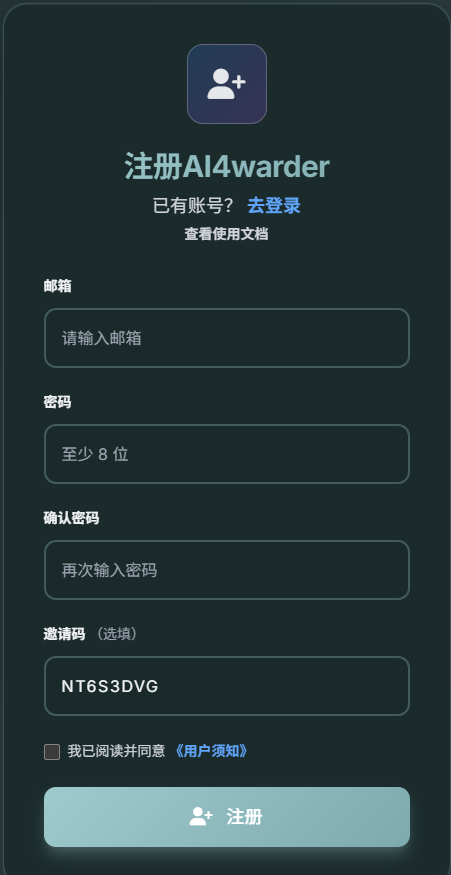
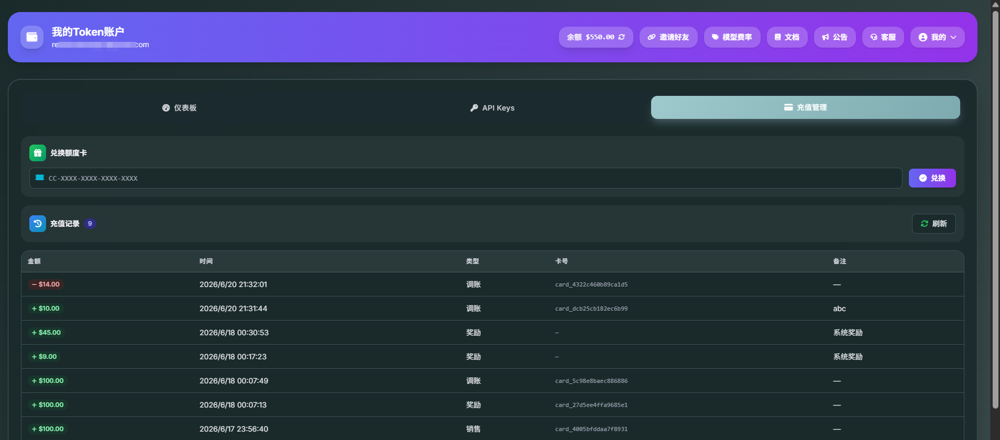
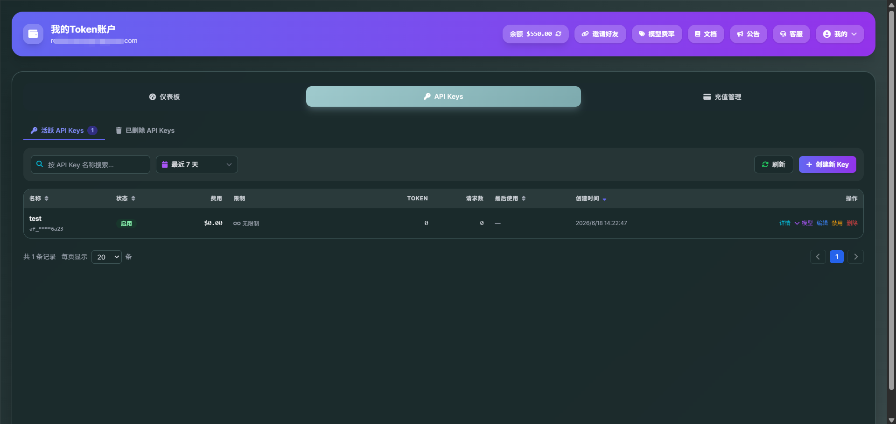
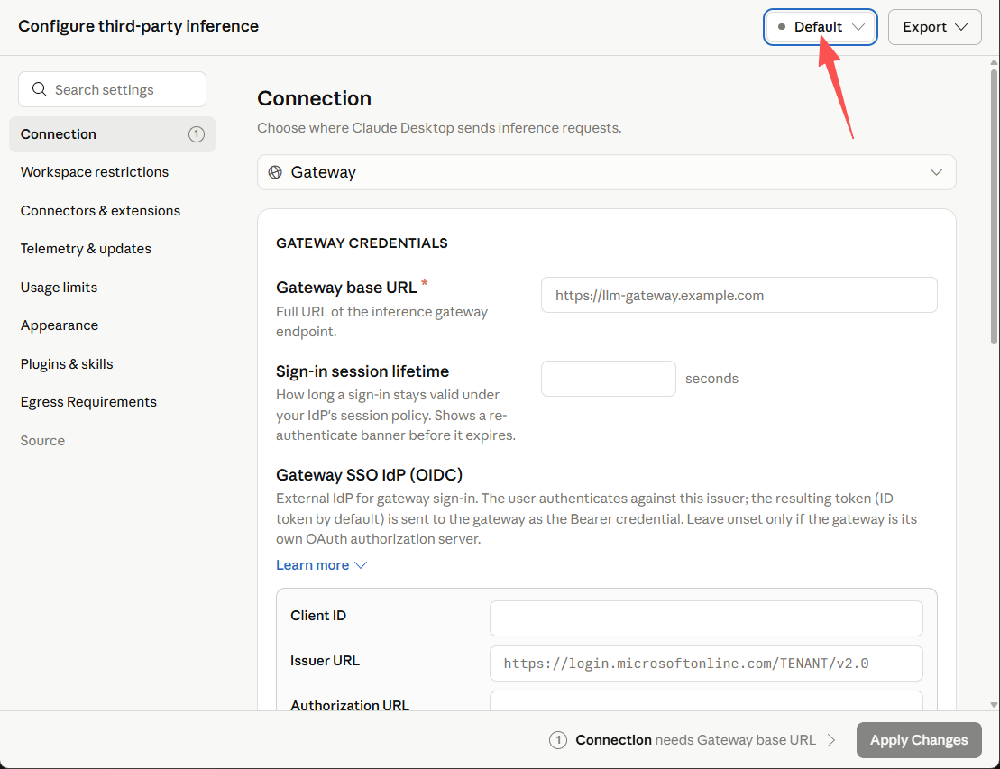
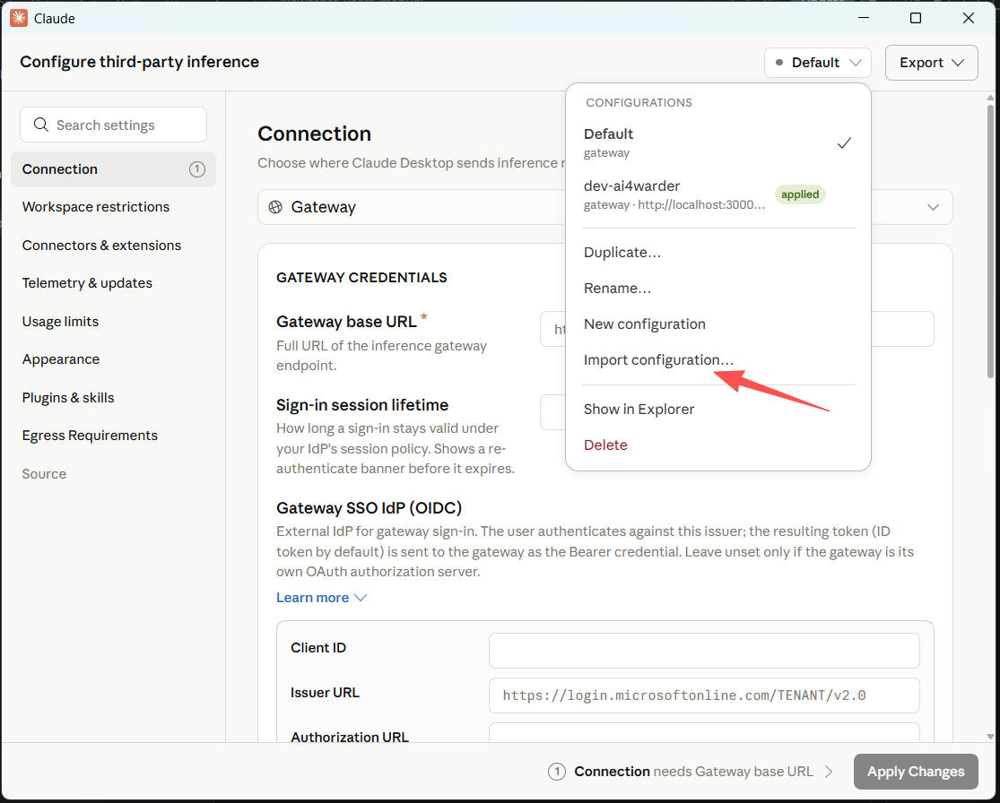
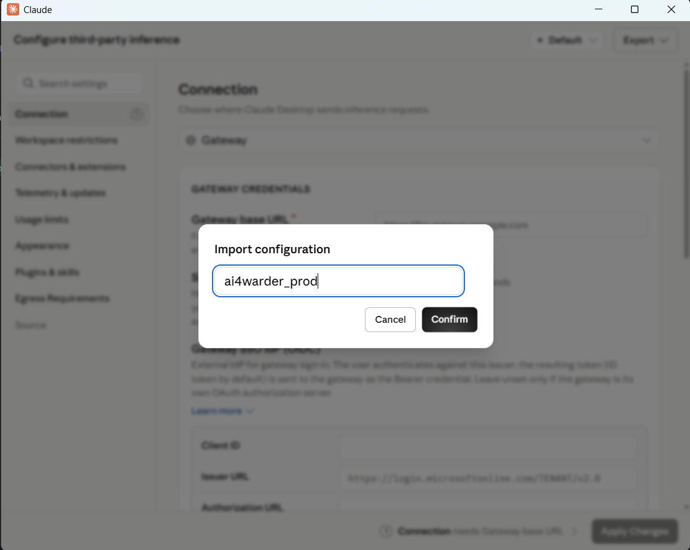
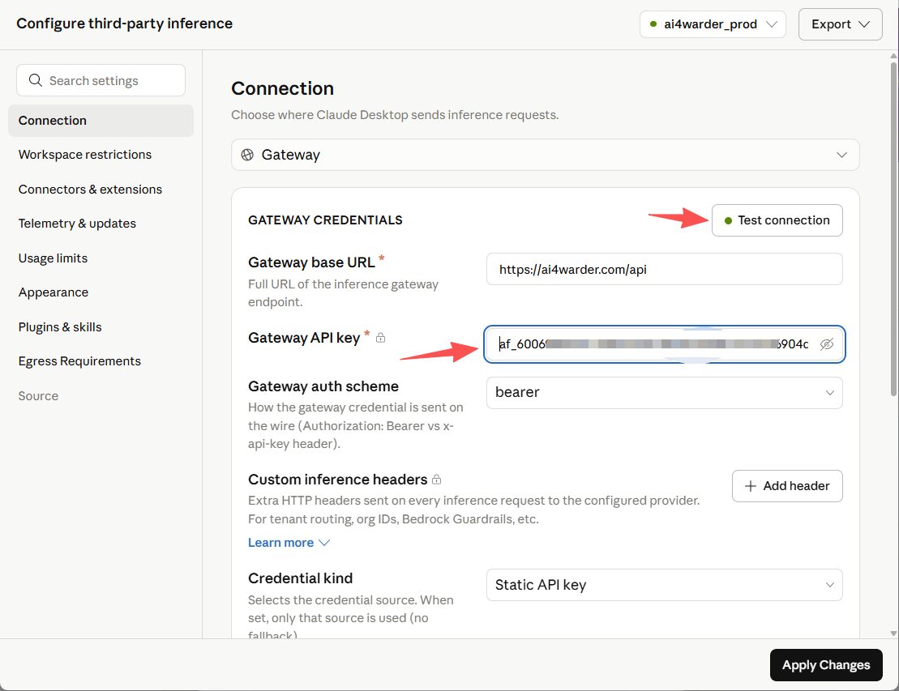
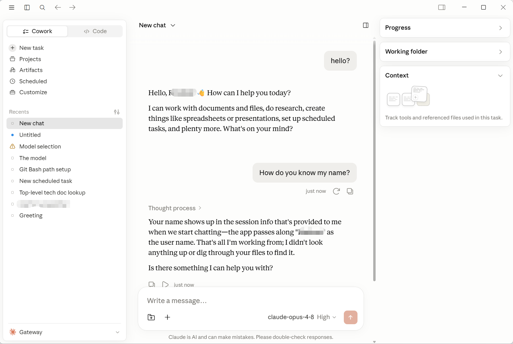

# Ai4Warder用户使用指南

本指南面向**Ai4Warder用户**，帮助你完成从注册到接入 Claude Code 的全部流程：

- [Ai4Warder用户使用指南](#ai4warder用户使用指南)
  - [一、注册账号](#一注册账号)
    - [使用邀请码 / 邀请链接注册（可选）](#使用邀请码--邀请链接注册可选)
    - [普通注册](#普通注册)
  - [二、登录](#二登录)
  - [三、充值（兑换额度卡）](#三充值兑换额度卡)
  - [四、创建 API Key](#四创建-api-key)
  - [五、配置 Claude Code 工作环境](#五配置-claude-code-工作环境)
    - [macOS / Linux](#macos--linux)
    - [Windows（PowerShell）](#windowspowershell)
    - [安装与启动 Claude Code](#安装与启动-claude-code)
    - [验证配置](#验证配置)
  - [六、配置 Claude Desktop App](#六配置-claude-desktop-app)
    - [下载并安装](#下载并安装)
    - [设置连接 Ai4Warder 服务器](#设置连接-ai4warder-服务器)
  - [七、常见问题](#七常见问题)

---

## 一、注册账号

### 使用邀请码 / 邀请链接注册（可选）

有好友 / 邀请人分享的**邀请码**或**邀请链接**时，注册时填上即可与对方建立邀请关系（邀请奖励按平台规则发放）。两种方式任选其一：

- **方式一：邀请链接（推荐，免手填）**
  直接打开好友分享的邀请链接，形如
  `https://ai4warder.com/wallet/register?invite=邀请码`
  打开后注册页会**自动填好邀请码**，你只需填邮箱、密码并点「注册」。

- **方式二：手动填邀请码**
  在注册页「**邀请码（选填）**」输入框填入 **8 位邀请码**（仅大写字母和数字，会自动转大写），再正常完成注册。

**系统会向你的邮箱发送一封验证邮件**。请打开邮件，点击其中的验证链接（或访问 `https://ai4warder.com/wallet/verify-email?token=...`）完成邮箱验证。

> **说明**
> - 邀请码为**选填**，留空即为普通注册，不影响使用。
> - 邀请码为 8 位，不含字母 I、O 和数字 0、1；填错会提示无效，请核对后重填。
> - 想邀请别人？登录后在「Ai4Warder 用户中心」点「**邀请好友**」复制你的专属邀请链接，或在「**我的**」里复制邀请码。

### 普通注册

1. 打开浏览器访问：[https://ai4warder.com/wallet/register](https://ai4warder.com/wallet/register)
2. 填写以下信息：
   - **邮箱**：用作登录账号，请使用真实可收信的邮箱
   - **密码**：至少 8 位，并再次输入确认
3. 点击「注册」。
4. **系统会向你的邮箱发送一封验证邮件**。请打开邮件，点击其中的验证链接（或访问 `https://ai4warder.com/wallet/verify-email?token=...`）完成邮箱验证。



> **注意**
> - 没收到验证邮件？先查看垃圾邮件箱；仍未收到可在登录页使用「重新发送验证邮件」。

---

## 二、登录

1. 访问登录页：[https://ai4warder.com/wallet/login](https://ai4warder.com/wallet/login)
   （直接访问站点首页通常也会自动跳转到登录页）
2. 输入**注册邮箱**和**密码**，点击「登录」。
3. 登录成功后进入**Ai4Warder 用户中心** `/wallet`，包含以下功能页签：
   - **仪表板**：余额、今日成本、累计用量等概览
   - **API Keys**：创建与管理你的密钥
   - **充值管理**：兑换额度卡
   - **账单 / 交易记录**：按日/月查看消费明细，支持导出 CSV

**忘记密码**：在登录页点击「忘记密码」，输入邮箱后按邮件指引重置即可。

---

## 三、充值（兑换额度卡）

本服务采用**额度卡**（兑换码）方式充值，余额以**美元**（USD）计量，按实际调用成本扣费。

1. 从公告板获得购买充值卡的链接，购买后得到**额度卡兑换码**，格式类似：
   `CC-XXXX-XXXX-XXXX-XXXX`
2. 登录后进入Ai4Warder 用户中心，打开「**充值管理**」页签。
3. 在输入框粘贴兑换码，点击「**兑换**」。
4. 兑换成功后页面会显示**本次充值金额**和**充值后新余额**，该金额立即计入你的钱包余额。



可在「**交易记录**」中查看每一笔充值与扣费历史。

> **说明**：账户余额低于系统阈值时，API 请求会被拒绝。请保持余额充足以保证调用不中断。

---

## 四、创建 API Key

API Key 是你调用中转服务的认证凭证。

1. 进入Ai4Warder 用户中心，打开「**API Keys**」页签，点击「**创建 API Key**」。
2. 填写参数：
   | 参数 | 是否必填 | 说明 |
   |------|---------|------|
   | **名称**（name） | 必填 | 1–64 个字符，便于自己区分用途 |
   | **单日成本限额**（dailyCostLimit） | 可选 | 单位 USD，`0` 或留空表示不限制 |
   | **总成本限额**（totalCostLimit） | 可选 | 单位 USD，`0` 或留空表示不限制 |
3. 点击「创建」。系统会生成一个以 **`af_`** 开头的密钥，例如：
   ```
   af_xxxxxxxxxxxxxxxxxxxxxxxx
   ```



> ⚠️ **重要：明文密钥只在创建时显示一次，刷新后无法再次查看。请立即复制并妥善保存。** 若遗失，只能删除后重新创建。

**密钥管理**：在「API Keys」列表中你可以
- 启用 / 停用密钥、修改名称与限额
- 删除（软删除，可在「已删除」中恢复）或永久删除
- 查看每个密钥的使用统计与逐请求调用记录

---

## 五、配置 Claude Code 工作环境

**NOTE**：如果您是 Claude Desktop 图形软件用户，请直接跳到[六、配置 Claude Desktop App](#六配置-claude-desktop-app)

拿到 API Key 后，只需配置两个环境变量，把 Claude Code 指向本中转服务即可。

- **服务地址（Base URL）**：`https://ai4warder.com/api`
  （以Ai4Warder 用户中心「使用教程 / 接入说明」页面显示的地址为准）
- **认证令牌（Auth Token）**：你刚创建的 `af_` 开头的 API Key

### macOS / Linux

临时生效（仅当前终端会话）：

```bash
export ANTHROPIC_BASE_URL="https://ai4warder.com/api"
export ANTHROPIC_AUTH_TOKEN="af_xxxxxxxxxxxxxxxxxxxxxxxx"
```

永久生效，写入 `~/.bashrc` 或 `~/.zshrc`：

```bash
echo 'export ANTHROPIC_BASE_URL="https://ai4warder.com/api"' >> ~/.zshrc
echo 'export ANTHROPIC_AUTH_TOKEN="af_xxxxxxxxxxxxxxxxxxxxxxxx"' >> ~/.zshrc
source ~/.zshrc
```

### Windows（PowerShell）

临时生效（仅当前窗口）：

```powershell
$env:ANTHROPIC_BASE_URL = "https://ai4warder.com/api"
$env:ANTHROPIC_AUTH_TOKEN = "af_xxxxxxxxxxxxxxxxxxxxxxxx"
```

永久生效（写入用户环境变量，需重启终端）：

```powershell
[System.Environment]::SetEnvironmentVariable("ANTHROPIC_BASE_URL", "https://ai4warder.com/api", "User")
[System.Environment]::SetEnvironmentVariable("ANTHROPIC_AUTH_TOKEN", "af_xxxxxxxxxxxxxxxxxxxxxxxx", "User")
```

### 安装与启动 Claude Code

```bash
# 安装（需 Node.js 环境）
npm install -g @anthropic-ai/claude-code

# 在你的项目目录启动
claude
```

### 验证配置

确认环境变量已生效：

```bash
# macOS / Linux
echo $ANTHROPIC_BASE_URL
echo $ANTHROPIC_AUTH_TOKEN

# Windows PowerShell
echo $env:ANTHROPIC_BASE_URL
echo $env:ANTHROPIC_AUTH_TOKEN
```

只要能输出你配置的地址和密钥，并且 `claude` 能正常对话，即接入成功。后续的调用费用会按实际用量从你的钱包余额中扣除。

---

## 六、配置 Claude Desktop App

Claude Desktop App 是 Anthropic 官方推出的桌面客户端（支持 macOS 和 Windows），提供与 Claude 模型的对话交互界面。与 Claude Code（命令行工具）不同，Desktop App 更适合日常聊天、写作、文档分析等通用场景。

通过将 Desktop App 配置为连接 Ai4Warder 中转服务器，你可以使用在本站创建的 API Key 直接在桌面端与 Claude 对话，费用从你的 Ai4Warder 钱包余额中按量扣除。

### 下载并安装

请自行到[Claude官网](https://claude.com/download)下载并安装Claude Desktop App。

### 设置连接 Ai4Warder 服务器

- 启动Claude Desktop，先不要登录；
- Mac端在顶部菜单栏寻找（Windows按官方文档，点击桌面版左上角三条横线）：
`Help -> Troubleshooting -> Enable Developer mode`
软件可能会自动重启；
- 下载[ai4warder_prod.json](./ai4warder_prod.json)配置文件。注意存储的文件名必须是`*.json`。
- 重新在菜单栏找`Developer -> Configure third-party inference`,点击进入配置界面, 点击右上角的"Default"按钮, 选择"import configuration"，导入上一步下载的配置文件,点击确认按钮；



- 填入你在本站创建的API KEY（可以与Claude Code共用KEY），保存。点击"Test connection"按钮，如果小圆点显示绿色则表示连接成功；如果显示橙色则表示测试返回错误。

- 点击窗口右下方应用和保存按钮，软件会自动登录。
- 此时，可以在Desktop软件中聊天测试。


---

## 七、常见问题

| 现象 | 排查方向 |
|------|----------|
| 收不到验证 / 重置邮件 | 检查垃圾邮件箱；在登录页重新发送验证邮件 |
| 充值兑换失败 | 确认兑换码完整无误、未被使用、未过期 |
| 创建 API Key 后找不到明文 | 明文仅显示一次，请删除后重新创建 |
| 调用报「余额不足 / 被拒绝」 | 钱包余额过低，请充值后重试 |
| 调用报认证失败（401） | 检查 `ANTHROPIC_AUTH_TOKEN` 是否正确、密钥是否被停用 |
| 调用无法连接 | 检查 `ANTHROPIC_BASE_URL` 是否为 `https://你的服务地址/api`，注意结尾路径 |
| 单日 / 总额超限 | 密钥触发了你设置的成本限额，可在「API Keys」中调整限额 |
| 529 Overload | 上游Claude服务器过载，请换个模型，或者几分钟后再重试 |
| 5XX error | 上游Claude服务器过载，几分钟后再重试 |
| Sonnet 1M Context 不可用| 使用Sonnet或者Opus 1M Context|

---

如有疑问，请联系服务管理员。
